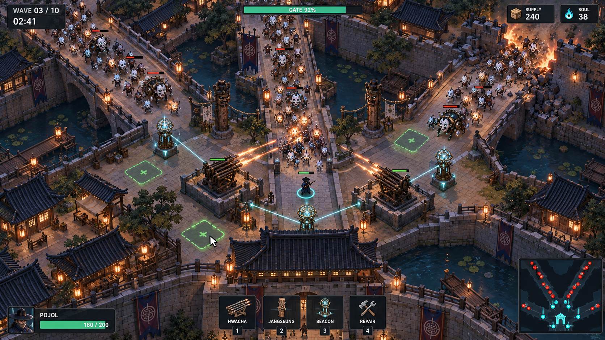
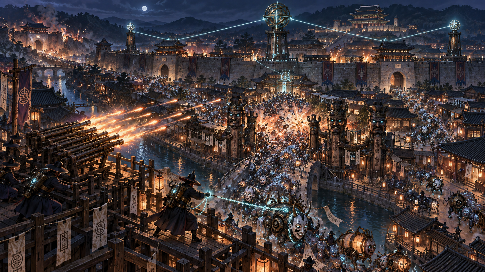

# 한양 디펜스 · Hanyang Defense

**한양 전체를 무기화하는 대규모 전투 디펜스.** 조선 사이버펑크 세계에서 적을 유도·압축하고 도시의 시설을 연결해 싸우는 로그라이트 디펜스 프로젝트입니다.

현재 단계는 **WP-001 DONE (GPT 재리뷰 PASS, 2026-09-13) · WP-002 REVIEW (2026-09-14 구현·검증 완료, GPT 판정 대기)** 입니다. Godot 4.7 프로젝트로 실행 가능한 회색상자 프로토타입(1,000개체 · 세 경로 · 장승 병목 · 화차 집중 사격)과 헤드리스 테스트, 릴리스 빌드·성능 측정 절차가 있습니다. 자동 에이전트 연동은 없습니다.

## 게임의 중심

- 플레이어: 적의 흐름을 바꾸고 위험한 전선을 재편한다.
- 시설: 지속 화력을 제공하고 봉수망으로 표적을 공유한다.
- 도시: 성문·골목·수로·관청이 하나의 전투체계가 된다.
- 실패 대응: 외곽 방어선 붕괴 후 안쪽으로 후퇴하며 병목을 다시 만든다.

**전투 → 자원 확보 → 건설 → 연결 → 검증 → 재편 → 전투**

## 문서 지도

| 문서 | 내용 |
|---|---|
| [CLAUDE.md](CLAUDE.md) | 구현 규칙, 테스트와 결과 전달 계약 |
| [GAME_DESIGN](docs/GAME_DESIGN.md) | 경험 목표, 세계관, 게임 범위 |
| [CORE_LOOP](docs/CORE_LOOP.md) | 코어 루프와 Mermaid 다이어그램 |
| [SYSTEM_SPEC](docs/SYSTEM_SPEC.md) | 시스템 책임, 규칙, 검증 방법 |
| [DECISIONS](docs/DECISIONS.md) | 확정 사항, 초기 제안, 미결정 사항 |
| [ROADMAP](docs/ROADMAP.md) | 단계별 목표와 통과 조건 |
| [WP-001](backlog/WP-001.md) | 대량 적 이동 → 병목 → 화차 사격 |
| [WP-002](backlog/WP-002.md) | 봉수망과 시설 간 표적 공유 |
| [WP-003](backlog/WP-003.md) | 웨이브 검증 → 붕괴 → 후퇴·재편 |
| [결과 양식](results/RESULT_TEMPLATE.md) | 구현 증거와 GPT 리뷰 기록 |
| [WP-001 결과](results/WP-001-RESULT.md) | WP-001 구현·검증 결과, AC별 증거, 성능 측정 |

## GPT ↔ Claude Code 작업 흐름

1. GPT가 기획·요구사항·수용 기준을 문서와 WP에 기록한다.
2. Claude Code가 해당 WP의 의존성과 기술 결정을 확인하고 구현·테스트한다.
3. Claude Code가 코드, 변경 비교, 결과 문서를 같은 작업 브랜치에 기록한다.
4. GPT가 결과와 실제 변경을 검토해 PASS 또는 REVISE를 기록한다.
5. PASS 후 다음 WP를 시작한다. REVISE이면 같은 WP의 기준을 유지하며 보완한다.

첫 단계는 Git 문서를 통한 수동 핸드오프다. 이 저장소만으로 GPT나 Claude Code가 자동 실행되지는 않는다.

### Claude Code에 전달할 요청

```text
README.md, CLAUDE.md, docs/GAME_DESIGN.md, docs/CORE_LOOP.md, docs/SYSTEM_SPEC.md, docs/DECISIONS.md와 backlog/WP-002.md를 읽는다.
최신 main에서 wp/002-bongsu-network 브랜치를 만들고 READY인 WP-002만 구현한다. Godot 4.7을 사용한다.
WP의 Scope만 구현하며 모든 Acceptance Criteria에 대해 증거를 남긴다.
실제 실행 화면과 재현 가능한 테스트 결과를 확인한다.
WP-001 회귀와 WP-002 AC-01~08을 검증한다. 새 증거는 results/evidence/wp-002/에 둔다.
results/RESULT_TEMPLATE.md를 복사해 results/WP-002-RESULT.md에 결과를 기록한다.
완료 후 REVIEW 및 Draft PR로 제출하고 GPT PASS 전에 병합하지 않는다.
구현 커밋과 기준 커밋, 변경 파일, 미해결 문제를 함께 전달한다.
```

### GPT에 전달할 리뷰 요청

```text
backlog/WP-002.md, results/WP-002-RESULT.md와 기록된 기준/구현 커밋의 diff를 검토한다.
게임 목표, 범위, 수용 기준, 실제 테스트 증거, 다음 WP 확장 가능성을 확인한다.
각 기준을 PASS / FAIL / NOT RUN으로 판정하고 최종 PASS 또는 REVISE를 결과 파일에 기록한다.
실패나 미실행 기준이 있으면 보완 작업을 명시한다. 증거 없이 통과시키지 않는다.
```

## 실행 환경 (WP-001에서 확정)

엔진은 **Godot 4.7.stable (GDScript, 2D 탑다운, gl_compatibility)** 이다. 근거와 성능 예산은 [DECISIONS D-007~D-011](docs/DECISIONS.md)에 있다. 기존 대화의 Unity 언급은 구현 예시였으며 채택하지 않았다.

### 설치

1. [Godot 4.7.stable](https://godotengine.org/download) 표준(비-.NET) 에디터를 받아 실행 파일을 `godot`이라는 이름으로 PATH에 둔다. 확인: `godot --version` → `4.7.stable.official.5b4e0cb0f`.
2. 릴리스 빌드를 만들려면 같은 버전의 **Windows export template**을 설치한다(에디터 → Editor → Manage Export Templates, 또는 `%APPDATA%\Godot\export_templates\4.7.stable\`).
3. 저장소를 체크아웃한다. 추가 패키지 설치는 없다. 최초 실행 시 Godot이 `.godot/` 캐시를 만든다(gitignore).

### 실행·테스트·빌드

```bash
# 플레이 (창 실행, 1920x1080 논리 해상도)
godot --path . --rendering-driver opengl3
```

```bash
# 헤드리스 자동 검증 (AC-01~06 대응, 종료 코드 0 = 전부 통과)
godot --headless --path . --script res://tests/run_tests.gd -- --report=results/evidence/test_report.txt
```

```bash
# 회색상자 지형·경로장 덤프 (ASCII)
godot --headless --path . --script res://game/tools/dump_map.gd
```

```bash
# 증거 캡처 (실제 실행 화면 PNG + 상태 JSON). ac01 / ac02 / ac06
godot --path . --rendering-driver opengl3 -- --capture=ac06 --out-dir=D:/abs/path/to/results/evidence/captures
```

```bash
# 릴리스 빌드 (export_presets.cfg 사용)
godot --headless --path . --export-release "Windows Desktop Release" build_out/windows/hanyang_defense_wp001.exe
```

```bash
# 성능 측정 (릴리스 빌드, 준비 10초 + 측정 60초, JSON 출력). 시나리오 move / combat
./build_out/windows/hanyang_defense_wp001.exe -- --perf --scenario=combat --warmup=10 --measure=60 --out=D:/abs/path/perf_combat.json
```

```bash
# P-007 측정: 포화 골목의 설치 성공률과 홀드 대기시간 (헤드리스, JSON 출력)
godot --headless --path . --script res://game/tools/probe_occupancy.gd -- --out=D:/abs/path/occupancy_probe.json
```

`--perf` 모드는 `benchmark_hold_alive`를 켜서 매 틱 끝에 동시 생존 수를 `target_alive`로 즉시 보충한다(D-009의 부하를 측정 프레임 전체에서 유지하기 위한 벤치마크 전용 규칙, 일반 플레이에서는 꺼져 있음). 결과 JSON의 `load_held_all_frames`가 true여야 부하 조건을 충족한 측정이다.

한 번에 전부 실행하려면 `scripts/verify.ps1`(Windows) 또는 `scripts/verify.sh`(Git Bash)를 사용한다. `verify.ps1`은 각 단계의 종료 코드·산출물·성능 합격 조건을 검사하고 실패 시 즉시 중단한다. 조작법과 명령행 옵션은 [game/scenes/main.gd](game/scenes/main.gd) 상단 주석, 밸런스·시드 설정값은 [game/core/config.gd](game/core/config.gd)에 있다. 기본 시드는 `20260913`.

### WP-002 봉수망 (2026-09-14)

기본 플레이는 **WP-002 모드**(`targeting_mode=wp002`: 화차는 로컬 100px + 같은 봉수망 그룹 센서의 탐지만 안다)와 **fixture B**(화차 4·봉수대 8·혼천의 4)로 시작한다. WP-001 검증 구성은 `--set targeting_mode=wp001 --set fixture=wp001`(테스트·캡처 `ac01/ac02/ac06`·성능 `move/combat`이 자동으로 고정)이다. 봉수대 연결 180px, 센서 탐지 140px, 화차 로컬 100px, 사거리 200px — 모두 `game/core/config.gd`.

```bash
# WP-002 fixture A 캡처: 비연결 → 연결(공유 사격) → 단절(오래된 표적 사격 없음) → 로컬 사격 → 복구
godot --path . --rendering-driver opengl3 -- --capture=wp002_a --out-dir=D:/abs/path/results/evidence/wp-002/captures
```

```bash
# WP-002 fixture B 성능 (16시설 + 1,000체). network_move / network_combat(B8 전환 12회 + 장승 (22,28) 12회)
.\scripts\perf_with_memory.ps1 -Scenario network_combat -Out results\evidence\wp-002\perf\perf_network_combat_1000_release.json
```

증거는 `results/evidence/wp-002/{tests,captures,perf}/`에 두고 WP-001 증거는 보존한다. `scripts/verify.*`가 WP-001 단계에 이어 4b(fixture A 캡처)·6b(fixture B 성능, 계약 검사 포함)를 실행한다.

### 조작

`LMB` 설치(누르고 있으면 셀이 빌 때까지 재시도) · `RMB` 제거 · `1/2/3/4` 장승/화차/봉수대/혼천의 모드 · `T` 커서 아래 시설 활성/비활성 전환(디버그 파괴·수리) · 시설에 커서를 올리면 부착 봉수대·그룹·로컬/공유 인지 수·표적 출처·대기 이유 패널 표시 · `C` 전투 토글(처치 끔) · `Z` 밀도 존 표시 · `G` 사거리/탐지/연결 반경 · `P` 일시정지 · `R` 초기화(같은 시드, 망·부착·표적 초기화 후 fixture 복원) · `H` HUD · `F12` 캡처(`%APPDATA%\Godot\app_userdata\...\captures`) · `Esc` 종료

## 공개 범위와 권리

저장소는 **공개(Public)** 다 (2026-09-13 사용자 요청, [D-010](docs/DECISIONS.md)). `docs/art/`의 이미지는 AI 생성 기획 참고 자료이며 실제 실행 화면이 아니다. 원본 대화·제삼자 에셋·폰트는 포함하지 않는다. HUD 한글은 Godot의 시스템 폰트 폴백으로 표시된다. 상용 제목·출시 일정·라이선스는 미정이다.

## 비주얼 기획

### 예상 플레이 화면



실제 실행 화면이 아닌 AI 생성 목업이다. 카메라·적 크기·경로·시설 배치의 가독성을 검토한다. 봉수망과 자원 HUD는 완성형 방향을 보여주며 WP-001의 구현 범위를 추가하지 않는다.

### 콘셉트 아트



조선 건축, 청동 병기, 장승과 봉수망의 분위기를 위한 AI 생성 콘셉트다. 실제 게임 카메라와 성능 목표를 표현한 화면은 아니다.

이미지별 용도와 구현 시 해석은 [비주얼 레퍼런스](docs/art/README.md)를 참고한다.
