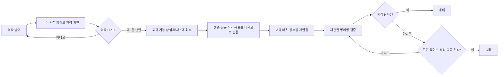

# WP-003 · 검증·붕괴·후퇴·재편

- Status: **DRAFT v0.2** (2026-09-15, GPT 작성·정리)
- Dependency: **WP-002 DONE 충족** — GPT PASS `869788b`, PR #2 병합 확인. 초안 기준 main `ca40886df37db6efbd06783e92fc017569e3c620`.
- 착수 조건: 아래 READY 체크리스트 완료 및 GPT READY 전환. 이 문서는 구현 착수 지시가 아니다.
- Owner: GPT 기획·리뷰 / Claude Code 구현·테스트
- 예정 Branch: `wp/003-collapse-retreat` (READY 이후 생성)
- Result: `results/WP-003-RESULT.md` (구현 시 생성, 현재 결과 없음)
- 참조: [SYSTEM_SPEC](../docs/SYSTEM_SPEC.md), [DECISIONS](../docs/DECISIONS.md), [WP-002 결과](../results/WP-002-RESULT.md).

## Goal

**외곽 방어선의 실패를 내곽 방어망을 다시 설계하는 선택으로 연결한다.**

플레이어가 다음 네 가지를 이해하고 조작할 수 있는 짧은 런을 만든다.

1. 어느 진입로에서 적이 새고 외곽 거점 HP가 줄어드는지 읽는다.
2. 외곽 붕괴 시 잃은 시설과 남은 방어 목표를 구분한다.
3. 지정 화차 1대를 내곽의 유효한 위치에 다시 배치하고 봉수망에 연결한다.
4. 재편이 적 밀도·공유 표적·처치·핵심 거점 피해를 바꿨음을 확인한다.

외곽을 끝까지 지키고 승리하는 경로도 허용한다. 붕괴를 승리의 필수 조건으로 만들지 않는다.

## 기존 기준과 이번 초안의 구분

**기존 기준 유지:** 외곽/내곽 두 구역, 외곽 HP0에서 한 번의 붕괴, 생존·신규 적 목표 변경, 외곽 시설 비활성, 지정 화차1대 무료 재배치, 핵심 HP0 패배 우선, 모든 생성 종료+적0+핵심 생존 승리, 종료/초기화 계약. 기존 로컬/공유 탐지·사거리·배치 검증도 유지한다.

**아래 세부 정책·수치는 제안:** 구역 경계·거점 위치, 누수 피해 처리 순서, 웨이브 편성, 회수 상태 전이, 붕괴 중 장승 처리, 재편 비교 배치와 성능 전환 시점. READY 전 기하·시뮬레이션 검토 후 DECISIONS의 채택 결정으로 옮긴다. 초안의 예시를 이미 검증된 밸런스나 구현 결과로 인용하지 않는다.

## Scope / Non-Goals

범위: 두 거점의 HP·피해, 유한한 짧은 웨이브, 구역/런 상태 전이, 적 도달 처리, 외곽 시설 일괄 비활성, 화차1대 회수/내곽 배치, 봉수망 재계산, 승패·재시작, 플레이어 안내와 증거 기록.

제외: 완성형 재화·건설 비용·수리/환급, 무작위 사건·보스·메타 성장·30분 런, 새 캐릭터 이동/능력, 적의 개별 시설 공격·시설 HP, 새 적 종류·새 진입로, 구역 재점령, 설치 예약·적 밀어내기. ‘후퇴’는 방어 목표·회수 시설·배치 영역의 전환이며 아직 없는 조작 캐릭터를 구현하지 않는다.

약점 노출은 **기존 적의 남문 집중 물량**을 첫 안으로 사용한다. 고속 적과 추가 진입로를 동시에 도입하지 않는다.

## 제안 규칙

### 1. 거점·구역·도달 처리

- 런 상태는 RUNNING / WON / LOST, 방어선 상태는 OUTER_ACTIVE / INNER_ONLY로 분리한다. 승리·패배는 최종 상태다.
- 시설의 구역 소속은 명시적 district_id로 관리한다. 2×2 footprint 전체가 한 구역 안에 있어야 배치할 수 있다. 경계에 걸치는 배치를 임의로 한쪽에 귀속하지 않는다.
- 검토 출발점: 현재96×54 맵을 바탕으로 외곽 거점 셀(47,26), 핵심 셀(47,10), 내곽 후보 영역 x42~53/y6~22. 나머지 통행 영역은 외곽 후보로 본다. **이 좌표는 설치·도달·사격 검증 전의 배치 후보**다. WP-001/002 전용 맵과 fixture는 보존하고 WP-003 전용 데이터로 분리한다.
- 모든 진입로는 현재 목표로 이동한다. 적이 목표 도달 조건을 충족하면 살아 있는 해당 개체를 한 번 소비하고 거점에 피해를 준다. 도달은 처치로 세지 않는다. 기본 도달 피해1, 외곽 HP120/핵심 HP60을 초기 검토값으로 제안한다.
- 한 틱의 도달 목록은 그 틱의 현재 목표로 확정한다. 같은 적 ID의 중복 도달은 무시한다. 외곽 HP는0에서 멈추며 그 틱의 초과 피해를 핵심으로 넘기지 않는다. 도달 적은 소비되므로 붕괴 직후 핵심에 다시 피해를 주지 않는다.
- 전투 이동→사격→남은 생존 적의 도달 판정 순서를 제안한다. 목표에 도달하는 틱에 사격으로 죽은 적은 거점에 피해를 주지 않는다. 이 순서는 기존 EnemySim의 즉시 도달 제거를 WP-003에서 분리해야 할 수 있으므로 READY 전 기술 영향 검토가 필요하다.

### 2. 붕괴는 한 번의 상태 전환

외곽 HP0을 처리하는 같은 틱에서 다음을 완료하고 다음 사격/배치 판단으로 넘어간다.

1. OUTER_ACTIVE→INNER_ONLY를 한 번 전환하고 collapse_count=1을 기록한다.
2. 지정 화차의 회수 상태를 생성한다. 나머지 외곽 화차·센서·봉수대는 비활성화한다.
3. 외곽 장승도 비활성 표시하되 **점유와 통행 차단을 유지**하는 안을 제안한다. 기존 비활성의 점유 유지 규칙을 따르며, 통행을 열어 주는 철거와 구분한다. 붕괴 후 목표까지의 경로가 이 상태에서 반드시 존재해야 한다.
4. 현재 목표를 핵심으로 바꾸고 생존 적 모두 새 경로를 사용하게 한다. 적의 좌표·HP·ID는 보존하고 순간이동·재생성하지 않는다. 이후 생성 적도 핵심을 목표로 삼는다.
5. 외곽 센서의 공유 정보를 폐기하고 내곽 봉수망을 재계산한다. 내곽 로컬/다른 유효 센서가 아는 적은 유지한다. 외곽 시설은 오래된 표적으로 마지막 한 발을 쏘지 않는다.

같은 틱의 반복 붕괴 호출, 이미 붕괴한 외곽의 추가 피해, 중복 명령은 추가 회수권·시설 복제·중복 이벤트를 만들지 않는다. 붕괴한 외곽에 새 시설을 설치하거나 T 디버그 전환으로 다시 활성화하는 행위는 일반 WP-003 모드에서 거절한다. 무효 배치는 공유 정보·경로·회수권을 바꾸지 않는다.

### 3. 지정 화차1대 회수·내곽 재배치

- 런 시작 데이터에서 구출 대상 화차 ID를 하나 지정한다. 붕괴 시 대상의 기존 점유를 해제하고 회수 대기 상태로 전환한다. 다른 외곽 시설은 남아 비활성 상태를 유지한다.
- 회수 화차는 월드에 존재하지 않는 대기 상태에서 사격·탐지·부착하지 않는다. 동일 논리 ID, 사거리/피해/폭발 반경/재장전 잔여·누적 집계를 보존한다. 개별 시설 HP는 아직 없으므로 가상의 회복 기능을 추가하지 않는다.
- 회수 중 재장전 잔여는 동결하는 안을 제안한다. 배치로0이 되지 않으며 배치 후 기존 틱 규칙으로 진행한다. READY 때 이 정책을 명시적으로 채택한다.
- 내곽의 현재 유효한 셀에만 배치할 수 있다. 현재 적 점유·지형·중복·구역 경계 검증을 통과한 **성공 시에만** 회수권을 소비하고 기존 ID 화차를 복원한다. 잘못된 클릭은 권리를 소비하지 않는다.
- 성공 배치는 한 번뿐이다. 재호출·입력 연타·중복 ID 요청은 거절한다. 단순 remove+new 생성으로 사격 기록/쿨다운을 초기화하는 구현은 허용하지 않는 안이다.
- 전투는 회수·배치 중 계속 진행한다. 안전한 배치 위치와 적의 내곽 도달 시간으로 기회를 제공한다. 붕괴 알림에 회수1/1·배치 가능 구역·핵심 HP를 표시한다. 시간이 실제로 확보되는지는 READY 전 검증한다.
- 내곽의 사전 배치된 봉수대·센서를 활용해 연결 위치를 선택한다. 이번 WP에서 새 경제나 무제한 무료 시설 설치를 도입하지 않는다. 비교용 내곽 장승도 시작 배치로 고정한다.

### 4. 유한 웨이브와 종료

| 웨이브 | 남/서/동 생성 수 제안 | 진입로별 생성 속도 제안 | 의도 |
|---|---|---|---|
| W1 | 60/60/60 | 각10체/초 | 기본 방어 읽기 |
| W2 | 120/120/120 | 각10체/초 | 누수 축적 관찰 |
| W3 | 360/120/120 | 남30·서10·동10체/초 | 남문 집중으로 방어 약점 노출 |

- 총1140체는 **생성 누계**이며 동시1000체 보장값이 아니다. 실제 생존 수·웨이브 길이·난이도는 아직 미검증이다. 적의 기존 HP60·이동 속도·화차 초기값은 유지한 상태에서 먼저 검토한다.
- 다음 웨이브는 현재 웨이브의 예약 생성 종료와 생존 적0 이후5초 대기 후 시작하는 안이다. 외곽 붕괴는 같은 웨이브를 계속하며 생성 예산을 초기화하지 않는다.
- 모든 웨이브 생성 종료 + 생존 적0 + 핵심 HP>0이면 승리. 핵심 HP0이면 즉시 패배. 마지막 적의 도달로 적0/핵심HP0이 동시에 되면 패배 우선이다.
- 종료 틱 이후 생성·이동·발사·피해·회수/배치·웨이브 타이머를 중단한다. 이미 큐에 있던 명령도 반영하지 않는다. 재시작은 별도 허용한다.
- 재시작은 HP·런/구역 상태·생성 예산/타이머·적/시설·망·표적·회수권·선택 상태·집계를 초기 데이터로 복원한다. 이전 런의 지연 명령은 run_id로 무효화한다. 같은 시드/명령으로 동일 결과를 재현해야 한다.

## Acceptance Criteria (DRAFT)

| ID | 합격 조건 초안 | 필수 검증 |
|---|---|---|
| AC-01 | 외곽 HP0에서 붕괴1회, 전투 계속 | HP1에서 복수 도달·중복 ID·중복 붕괴 호출, count1·초과 피해 미전달·회수권1·상태 전이 로그 |
| AC-02 | 생존/신규 적이 내곽으로 이동 | 붕괴 직전/같은 틱/직후 생성, 좌표·HP·ID 보존, 전 진입로 도달 가능, 옛 목표 재피해0·도달 중복0 |
| AC-03 | 외곽 기능 중단 및 지정 화차1대만 유효 재배치 | 외곽 사격/탐지/공유0, 점유·장승 차단 정책, 타구역/점유 거절·권리 보존, 성공1회·중복0, 같은 ID·쿨다운 보존, 새 부착/표적 유효성 |
| AC-04 | 내곽 재편이 전투 결과를 바꿈 | 동일 붕괴 스냅샷·적 상태·시드·명령 시각에서 비교. 비연결 배치 A와 연결·병목 활용 B의 인지/사격/처치/핵심피해·실제 화면. READY 때 성공 지표와 임계값 고정 |
| AC-05 | 정상 방어/붕괴 후 승리/최종 패배 모두 종료 규칙 충족 | 외곽 생존 승리, 내곽 전환 승리, 핵심0 패배, 마지막 적/핵심0 동시 조건의 패배 우선 |
| AC-06 | 종료 후 정지·재시작 완전 초기화 | 승리/패배 각각 종료 후 추가120틱 불변, 지연 명령 무효, 재시작 HP/예산/시설/망/회수권 복원·결정성 |
| AC-07 | 기존 회귀와 붕괴/재편 성능 예산 충족 | WP-001/002 회귀, 아래1000체 전환 벤치마크, 원시 프레임/생존 배열·이벤트·manifest·메모리·종료코드 |
| AC-08 | 상태 변화와 재배치 선택을 읽고 재현 가능 | 실제 외곽 방어→붕괴→회수→거절/유효 미리보기→내곽 사격→종료 화면·JSON, 조작 안내, 새 체크아웃 명령·결과 문서 |

## 증거 시나리오 초안

- F1 정상 방어: 외곽을 유지한 채 유한 웨이브 종료/승리. 붕괴를 강제하지 않는다.
- F2 강제 붕괴: 같은 초기 상태에서 외곽 HP1과 도달 적으로 전환을 유발한다. 생산 코드의 피해→붕괴 경로를 사용하고 상태 값을 직접 INNER_ONLY로 바꾸지 않는다. 강제 HP 설정은 검증용이라고 표시한다.
- F3 재편 비교: F2 직후 스냅샷을 복제해 A/B의 화차 위치만 다르게 한다. 적·거점HP·쿨다운·관측 구간을 같게 유지한다. 비교용 후보 영역이 로컬/센서/사거리 원과 실제로 교차하는지 P-010 교훈에 따라 사전 검증한다.
- F4 패배·초기화: 핵심 HP1/마지막 도달 적 조건과 종료 후 지연 명령, 재시작을 검증한다.
- 모든 fixture는 설치 성공·시설 수·그룹·적 수 등 setup을 먼저 단언한다. 실제로 다른 구성이 만들어졌는지 확인한 뒤 효과를 비교한다.

## 성능 검증 방향 (부하/좌표는 READY 때 고정)

기존 D-009 예산 유지: Windows 독립 릴리스1080p,준비10초+측정60초,평균≥60 FPS,p95≤25ms,모든 기록 프레임 생존≥1000. 후보 계산 비용을 포함한 이동 모드와 전투 모드를 구분한다.

- 각 실행에서 실제 붕괴1회→목표/망 갱신→화차 회수→내곽 유효 재배치1회를 측정 구간 안에 포함한다. 전환 전/후 구간이 충분히 남도록 측정20초 붕괴·25초 배치를 검토 출발점으로 삼는다.
- 유한 웨이브의 자연 종료와 부하 유지 벤치마크를 분리한다. 벤치마크만 즉시 보충 및 핵심 생존 유지 설정을 사용하며 정상 승패 증거로 인용하지 않는다. 강제 생존 정책과 모든 생성 설정을 manifest에 공개한다.
- 새 목표로 바뀌는 틱·경로 재계산·외곽 비활성·망 재편·회수/배치 전후의 시각,상태,성공/거절,시설 수,구역별 활성 수,현재 목표,버전을 기록한다. 측정 구간 발사/공유 사격은 준비 구간과 분리한다.
- 1000체에서 재배치 셀이 비어 있지 않을 경우 거절을 숨기지 않는다. 안전한 고정 셀·합법 배치 시각을 READY 전에 찾고 실제 사용한 위치를 기록한다.
- 시작/끝 HP·active·소속·목표·적 수 및 frame_us_raw/alive_raw,평가 횟수,메모리,실행/코드 SHA를 남긴다. dirty 표기 자료는 정확한 코드 출처 증빙 또는 깨끗한 빌드 재측정으로 보완한다.

## READY 체크리스트

1. **지도 확정:** 구역 경계·두 목표·초기 시설·구출 화차ID·내곽 A/B 배치·후보 영역 좌표를 표로 고정한다. 전체 footprint 적법성,모든 목표까지 경로,장승 유지 상태에서도 접근 가능함을 검증한다.
2. **기획 결정:** P-012~016의 제안(도달 순서/초과 피해,장승 유지,회수/재장전,유한 웨이브,비교/벤치마크)을 채택·수정하고 SYSTEM_SPEC에 확정 규칙을 반영한다.
3. **조작 기회:** 전투를 계속한 상태에서 붕괴 알림을 읽고 합법 내곽 배치할 시간이 있는지 확인한다. 실패하면 지형/유입 간격 또는 별도 준비시간 안을 기획 결정으로 남긴다.
4. **F3 합격 기준:** 연결만으로 얻는 공유 표적,병목 밀도와 관측 구간을 고정하고 B가 A보다 무엇을 얼마나 개선해야 하는지 수치화한다. 측정 후 유리한 임계값을 고르지 않는다.
5. **재현 부하:** 모드별 초기시설/활성 수·전환 시각·검증 셀·HP 보호 설정·측정 항목과 기대 이벤트 수를 확정한다. 일반 플레이 수치와 구분한다.

## Completion Output (READY 이후)

`results/WP-003-RESULT.md`에 기준/구현 SHA,AC-01~08 PASS/FAIL/NOT RUN,fixture manifest,이벤트·캡처·회귀/성능 결과,알려진 문제,다음 기획 영향을 기록한다. 새 증거는 `results/evidence/wp-003/`에 두고 기존 증거를 보존한다. 구현 검증 후 REVIEW/Draft PR, GPT PASS 후 DONE. 이 초안 단계에서는 게임 코드·결과 문서·구현 PR을 생성하지 않는다.

## 결정 요청 후속 판단 (2026-09-15)

아래는 초안 이후의 최신 GPT 판단이다. 충돌하는 초기 제안은 이 절이 우선한다. 일부 정책을 채택했으나 전체 fixture/기술 검토가 남아 있어 **DRAFT 유지**다.

| 요청 | 판정 | 내용 |
|---|---|---|
| D-a | **채택 · D-019** | WP-003 전용 후보 영역을 추가한다. WP-001/002는 기존8존 유지. WP-003은 기존 Z0~7 + Z8 광장 남단 + Z9 광화문 앞의10존을 초기 기준으로 사용한다. |
| D-b | **채택 · D-020** | 회수 대상은 초기 화차·중영 anchor(46,29), 중심(940,600). 생성 시 부여된 안정 ID를 데이터에 연결하며 이름 검색이나 목록 순서로 대상을 재선택하지 않는다. |
| D-c | **비교 후보 수용 · 기하 확정 보류** | A(52,12)=(1060,260), B(44,13)=(900,280)를 유지한다. 제시된 A↔B3 184.4px·B↔B2 164.9px는 사전 검토 보고값이며 전체 봉수대 좌표가 없어 독립 검증하지 못했다. A는 모든 활성 내곽 봉수대와180px 초과인지, B는 최근접 단일 부착과 유효 센서까지 연결되는지 확인해야 한다. |
| D-d | **채택 · D-021** | 하드5초 제한·자동 패배·자동 재배치는 두지 않는다. 전투를 계속하면서 핵심 HP 버퍼로 조작 기회를 준다. F3는 비교 시점을 붕괴+5초의 같은 틱으로 고정하고 양쪽 모두 이때 핵심 생존·합법 배치 가능을 요구한다. |
| D-e~D-h | **내용 확인 대기** | 기술 항목의 상세 본문을 아직 받지 못했다. 승인·반려로 간주하지 않는다. |

### WP-003 전용 존 초기값 (D-019)

| ID | 이름 | 중심(px) | 밀도 반경 |
|---|---|---|---|
| Z8 | 광장 남단 | (950,560) | 70px |
| Z9 | 광화문 앞 | (950,410) | 50px |

- 후보 존 추가는 탐지 정보를 무료로 주지 않는다. 화차별 로컬/동일망 센서의 알려진 적만 영역 밀도에 포함한다. 로컬100·센서140·사거리200·피해34 등 WP-002 기본값은 유지한다.
- 기존 외곽 목표 후보(950,530)는 Z8 안에 있고 중영 중심에서 약70.71px로 로컬 탐지 안이다. 중영↔Z8 중심은 약41.23px로 사거리 안이다. 따라서 기존 초안의 외곽 목표 주변 표적 선택 공백을 해소하는 기하적 출발점이 된다. F1 승리가 실제 성립하는지는 유한 웨이브 검증이 필요하다.
- A↔Z9 중심은 약186.01px, B↔Z9는 약139.28px로 둘 다 사거리200 안이다. Z9 중심의 적은 둘 다 로컬100 밖이므로 센서 연결 효과를 통제된 비교로 확인할 수 있다. 센서의 실제 좌표·관측 가능성과 이동 적의 체류시간은 READY 전 확인한다.
- A는 비연결, B는 연결이어도 A의 로컬 탐지는 계속 작동한다. 전체 관측 구간 A의 모든 사격이0이어야 한다고 요구하지 않는다. 같은 적 위치·관측 시점의 공유 전용 표적 사격 차이와 이후 핵심 피해를 구분해서 기록한다.
- 시설 footprint와 후보 영역 원은 다른 개념이다. 원이 벽 일부와 겹친다는 이유로 적을 벽에 생성하거나 센서를 불법 배치하지 않는다. 살아 있는 통행 셀의 적만 사용하는 fixture를 확정한다.

### 조작 기회·F3 관측 (D-021)

붕괴+5초는 자동 배치 마감이나 플레이어 실패 조건이 아니라 반복 가능한 A/B 검증 입력 시점이다. 같은 붕괴 스냅샷에서 동일5초 대기 후 각각 A/B에 배치한다. 그동안 전투·이동·핵심 피해는 정상 진행하며 숨은 무적·일시정지·적 순간이동을 사용하지 않는다. 이때 양쪽 모두 핵심HP>0이고 권리를 유지한 채 유효 배치할 수 있어야 한다.

지연0/5/10초의 핵심 HP·첫 피해 시각·합법 배치 가능 여부도 관측한다. 10초 지연 생존은 현재 필수 합격선이 아니며 여유를 파악하기 위한 비교다. 초기 핵심HP60은 여전히 검증 전 제안값이다. 5초 기회가 성립하지 않으면 HP/유입 간격/내곽 접근거리의 수정안을 기획 기록으로 남겨 확정한다. 구현자가 임의로 무료 보호시간을 넣지 않는다.

READY 잔여 항목: B2/B3 포함 내곽 전체 시설 좌표·센서 관측, A/B 합법 배치와 최근접 연결 확인, 새10존 기반 F1/F3 시나리오·개선 임계값, D-e~D-h의 상세 기술 검토, 고정 성능 fixture. 현재 초안의 전체 READY 체크리스트도 계속 적용한다.
