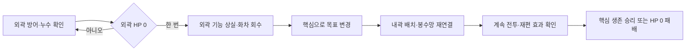

# WP-003 · 검증·붕괴·후퇴·재편

- Status: **DONE** (2026-09-15. READY v1.0 `31193a3` → 구현 `7fc75ab`/`6e9240c` → GPT 1차 REVISE `f379bea`(D-032) → 보완 `8ec66aa`→`41ff91c` · 증거 `1598d23` → GPT 재리뷰 2차 **PASS 8/0/0** `f5d7e69`. PR #4 병합은 사용자 지시에 따른다.)
- Dependency: WP-001/002 DONE. WP-002 GPT PASS `869788b`, PR #2 병합 완료.
- 기준: main `2efac7d`의 코드·사전 검토 + 이 READY 문서. 구현 착수 기준 SHA: `31193a3` (READY 커밋).
- Owner: GPT 기획·리뷰 / Claude Code 구현·테스트
- Branch: `wp/003-collapse-retreat`
- Result: `results/WP-003-RESULT.md` (구현 시 생성)
- 참조: [SYSTEM_SPEC](../docs/SYSTEM_SPEC.md), [DECISIONS](../docs/DECISIONS.md), [사전 기술 검토](../docs/reviews/WP-003-PRE-REVIEW.md)

**READY는 규칙·fixture·합격선이 확정되어 구현을 시작할 수 있다는 뜻이다. 구현 AC·밸런스·성능은 아직 NOT RUN이며 PASS를 부여하지 않았다.** 이 문서는 DRAFT v0.2와 후속 미정 목록을 대체한다. 과거 초안·검토 이력은 Git과 사전 검토 문서에 보존한다.

## Goal

외곽 방어선의 실패를 내곽 방어망을 다시 설계하는 선택으로 연결한다. 플레이어가 누수와 거점 피해를 읽고, 붕괴 후 화차 1대를 회수하여 내곽에 배치하고, 봉수망 연결이 공유 사격과 핵심 생존을 바꾸는 것을 확인한다. 외곽을 끝까지 지키는 승리도 허용한다.

## Scope / Non-Goals

범위: 두 거점 HP·피해, 유한 웨이브, 붕괴 1회, 생존·신규 적 목표 전환, 외곽 시설 비활성, 동일 화차 1대 무료 재배치, 봉수망 갱신, 승패·재시작, 상태 안내와 재현 증거.

제외: 재화·건설 비용·수리/환급, 새 캐릭터 이동/스킬, 적 종류·진입로 추가, 보스·메타 성장, 개별 시설 HP/공격, 외곽 재점령, 예약 설치·적 밀어내기. 후퇴는 방어 목표·배치 영역의 전환이다. 일반 플레이는 초기 시설과 회수 배치만 사용하며 자유 신설·철거·T 재활성 디버그 명령은 제공하지 않는다. 거절 검증용 API는 실제 배치 검증 경로를 사용한다.

## 1. 고정 지도·시설 (D-019/020/022)

WP-003 데이터만 분리한다. 기존 96×54, 셀 20px, 통행 지형과 세 진입로를 유지한다. WP-001/002는 기존 8존·fixture·도달 순서를 보존한다.

| 항목 | 확정값 |
|---|---|
| 외곽 목표 | 셀 (47,26), 중심 (950,530) |
| 핵심 목표 | 셀 (47,10), 중심 (950,210) |
| 내곽 | x42~53, y6~22, 양끝 포함. 이 안의 통행 셀 |
| 외곽 | 나머지 통행 셀 |
| 시설 소속 | 2×2 footprint 전체가 같은 구역이어야 함. district_id 명시 |
| 후보 존 | 기존 Z0~7 그대로 + Z8 (950,560)/r70 + Z9 (950,410)/r50 = 10존 |
| 회수 A | anchor (52,12), 중심 (1060,260), 비연결 |
| 회수 B | anchor (44,13), 중심 (900,280), B2 연결 |

초기 시설은 아래 순서로 생성하고 안정 ID를 manifest에 기록한다. 예상 ID는 setup 단언용이며 회수 대상은 생성 시 H1의 ID를 저장한다. 이름 검색으로 회수 대상을 다시 고르지 않는다.

| 예상 ID | 종류/이름 | anchor | 구역 |
|---|---|---|---|
| 1 | 화차 H1 중영 · 회수 대상 | (46,29) | 외곽 |
| 2 | 화차 H2 서영 | (30,25) | 외곽 |
| 3 | 화차 H3 동영 | (64,25) | 외곽 |
| 4 | 화차 H4 궁성 | (46,17) | 내곽 |
| 5~8 | 봉수 B1/B2/B3/B4 | (34,21)/(42,21)/(50,21)/(58,21) | 외/내/내/외 |
| 9~12 | 봉수 B5/B6/B7/B8 | (34,29)/(42,29)/(58,29)/(44,33) | 외곽 |
| 13~16 | 센서 S1/S2/S3/S4 | (30,27)/(62,27)/(44,39)/(47,15) | 외/외/외/내 |
| 17~18 | 장승 J1/J2 | (44,36)/(22,24) | 외곽 |

초기 18시설=화차4·봉수8·센서4·장승2, 내곽4/외곽14. 추가 내곽 장승은 두지 않는다. 광화문 지형 병목과 동일한 외곽 장승을 두 비교 모두 사용한다.

A↔최근접 B3=184.39px로 미부착, B↔B2=164.92px로 부착. 내곽 B2↔B3=160px, S4↔B3=134.16px로 같은 망이다. A/B 모두 Z9 중심이 사거리200 안이다. S4↔Z9 중심=90.55px지만 반경을 더하면140.55px이므로 **Z9 전체 관측은 요구하지 않는다**. r50을 유지하고 개체별 실제 탐지 여부를 검사한다. 원이 벽과 겹쳐도 벽에 적을 생성하지 않는다.

위 거리·합법 후보·장승 유지 후 세 진입로의 핵심 접근은 기존 코어의 사전 검토 probe 두 개를 GPT가 2026-09-15 재실행해 확인했다. 실제 이동 후 점유·전투 성능·승패를 검증한 결과는 아니다.

## 2. 상태·도달·붕괴 (D-023)

- 런 상태 RUNNING/WON/LOST와 방어 상태 OUTER_ACTIVE/INNER_ONLY를 분리한다.
- 기본값: 외곽 HP120, 핵심 HP60, 개체 도달 피해1, 목표 반경26px. 기존 적 HP60·속도58±22%·화차 피해34/재장전0.8초/폭발55/사거리200·로컬100·센서140·연결180 유지. 시드20260913, 고정60Hz.
- WP-003 틱: 유효 명령 → 생성 → 이동 → 밀도/망/탐지 → 사격 → 생존 도달 목록 확정·소비/거점 피해 → 필요 시 붕괴·목표/망 갱신 → 승패·웨이브 갱신 → 벤치마크 보충.
- 도달 위치에서 사격으로 죽은 적은 도달 피해를 주지 않는다. 도달은 처치가 아니다. 같은 ID는 1회만 소비한다. 이동 중 도달 후보를 수집하는 구현도 가능하나 사격 후 살아 있는 ID를 다시 검증한다.
- 한 틱의 도달은 틱 시작 목표에 귀속한다. 외곽 HP는0에서 멈추고 초과 피해를 핵심에 넘기지 않는다. 그 틱의 외곽 도달 적은 모두 소비하며 전환 후 핵심에 재피해를 주지 않는다.
- D-e 채택: arrival_mode의 immediate(기존 WP-001/002) / after_fire(WP-003) 또는 동등한 명시적 모드 격리. 기존 모드의 도달 시각을 바꾸지 않는다.

외곽 HP0 틱에 아래를 한 번 완료한다.

1. INNER_ONLY 전환, collapse_count=1, H1 회수권1 생성.
2. H1은 분리 대기 상태. 다른 외곽 시설은 active=false, 점유 유지. 장승도 차단 유지.
3. 목표를 핵심으로 전환하고 경로를 한 번 재계산한다. 이 전환으로 path_version은 +1. H1 제거/배치는 비차단이므로 불필요한 경로 재계산을 하지 않는다.
4. 생존 적 좌표·HP·ID 보존, 다음 이동부터 새 경로 사용. 신규 적도 핵심 목표. 순간이동·재생성 금지.
5. 외곽 관측 출처를 폐기하고 내곽 망·인지 집합을 갱신한다. 붕괴 처리 완료 이후 외곽 사격·탐지·공유는0. 그 틱의 붕괴 이전 사격은 정상이다.

중복 붕괴/추가 외곽 피해로 회수권·이벤트를 중복 생성하지 않는다. 일반 모드의 외곽 재건/재활성 요청은 거절한다. 실패 명령은 점유·경로·망·회수권을 바꾸지 않는다.

## 3. 회수·조작 기회 (D-021/024)

- H1 기존 점유를 해제하고 동일 논리 ID·스탯·누적 집계·재장전 잔여를 보존한다. 분리 중 사격·탐지·부착을 하지 않는다.
- D-f 채택: **분리된 화차만 쿨다운 동결**. 일반 비활성 시설의 기존 쿨다운 감소 정책은 유지한다. 분리 여부를 감소 전에 검사한다.
- 현재 적 점유·지형·중복·구역을 모두 검증한 내곽 배치 성공 때만 권리를 소비한다. 성공은 1회. 실패/연타/중복 요청은 무료 재장전·새 ID·복제·권리 소모를 만들지 않는다.
- 회수 중 전투 계속. 하드5초 제한·자동 배치·자동 패배 없음. 핵심 HP 버퍼로 조작 기회를 준다. 일반 플레이에 숨은 무적·시간 정지·적 밀어내기 없음.
- F2/F3는 붕괴+5초의 같은 틱에 배치하고 그때 핵심HP>0·합법 배치를 요구한다. +0/+5/+10초 지연도 별도 복제 실행으로 관측한다. +10초 생존은 필수 합격선이 아니다.
- 붕괴 전18시설, 회수 대기 중 월드17+대기1, 배치 후 월드18+대기0. 정상 F2 기준 붕괴 후 활성4/외곽 비활성13, 배치 후 활성5/비활성13.

## 4. 유한 웨이브·종료 (D-025)

D-h 채택. 아래 수치는 구현 초기 기준이며 출시 밸런스가 아니다.

| 웨이브 | 남/서/동 생성 수 | 남/서/동 생성 속도 |
|---|---|---|
| W1 | 60/60/60 | 각10체/초 |
| W2 | 120/120/120 | 각10체/초 |
| W3 | 360/120/120 | 30/10/10체/초 |

총1140체는 누계. 초기 생존0, 런 시작 W1. 각 진입로는 기존 진입 셀의 안정 순서/시드 정책을 유지하고 시작 후 1/rate마다 생성한다. 고정 틱 누산기를 사용하며 생성 순서 남→서→동을 고정한다. 기존 스폰 위치·속도 분산 정책과 RNG 상태도 manifest/스냅샷에 기록한다.

예약 생성 종료+생존0 이후5초에 다음 웨이브. 붕괴가 예산·타이머를 초기화하지 않는다. 마지막 웨이브 예약 종료+생존0+핵심HP>0이면 WON, 핵심HP0이면 LOST 우선. 종료 후 생성·이동·발사·피해·회수/배치·웨이브 타이머 중단. 재시작만 허용한다.

재시작은 초기 HP·시설·적·예산·타이머·망·표적·회수권·선택·집계를 복원한다. run_id를 갱신하여 이전 런의 지연 명령을 무효화한다. 같은 시드와 입력의 결과는 run_id 자체를 제외하고 동일해야 한다.

## 5. 고정 검증 시나리오 (D-026)

모든 setup은 설치 성공·시설 수·구역·간선·단말 부착·목표·시드·존 수·적 상태를 먼저 단언한다. 합격선은 아래로 고정하며 측정 후 유리하게 바꾸지 않는다. 시뮬레이션 시간은 60Hz 틱 기준이다.

### F1 정상 방어 승리

18시설·10존·HP120/60·표의 전체1140웨이브. 추가 입력·강제 피해·보충·무적 없음. 300초 이내 WON, collapse_count=0, outer_hp>0, core_hp=60, spawned=1140, alive=0을 요구한다. 생성=처치+도달+생존 장부가 일치해야 한다. 시간 초과는 FAIL이며 임의 조기 종료 승리 금지.

### F2 실제 웨이브에서 붕괴·재편·승리

F1과 같은 설정에서 런20초에 검증용으로 outer_hp=1을 설정하고 외곽 목표 중심에 정상 HP60 적1체를 추가한다. 실제 도달 피해 처리로 붕괴시킨다(상태 직접 변경 금지). 이것은 강제 붕괴 검증이며 자연 붕괴 밸런스 증거가 아니다. 추가 적을 별도 예산으로 기록하여 전체 생성1141체를 맞춘다.

붕괴 틱 기준+5초에 H1을 B에 배치. 그 시점 core_hp>0, 유효 배치 성공1회, 300초 이내 INNER_ONLY/WON 및 핵심 생존을 요구한다. +0/+10초 배치는 동일 붕괴 스냅샷의 별도 관측이며 필수 승리는 +5초 실행이다. 적이 셀을 점유해 +5초 배치가 거절되면 FAIL로 보고한다. 성공할 때까지 숨겨서 재시도하지 않는다.

### F3 A/B 연결 효과 분리 비교

궁성 H4가 먼저 전부 처치하여 회수 화차 차이를 가리는 것을 피하기 위해 **이 시험만 H4를 시작부터 비활성**으로 고정한다. 양쪽 모두 동일하며 일반 플레이/F2에 적용하지 않는다. 자동 웨이브는 끄고 유한 시험 생성 목록을 사용한다. 나머지 18시설·10존·스탯은 동일.

1. outer_hp=1, core_hp=60, 외곽 목표 중심에 정상 적1체를 넣어 실제 피해로 붕괴. H1의 회수 순간 쿨다운·RNG·시설·예산·적·run 상태 전체를 저장한다.
2. 이 스냅샷과 미래 생성 목록을 A/B로 복제한다. 붕괴+5초에 각각 A/B로 배치한다. 배치 전까지 상태는 완전히 같아야 한다.
3. 배치 직후 다음 전투 틱의 생성 단계에서 정상 HP60·속도58의 적12체를 (950,450)에 생성한다. 이 통제 시험은 speed_jitter=0/lane_offset=0, 겹침 생성 허용인 현행 적 규칙을 사용한다. 살아 있는 통행 셀이며 스폰 예산12를 양쪽 동일하게 예약한다. 이 시험의 예약이 남아 있는 동안 조기 승리하지 않는다.
4. +5초부터30초를 관측한다. 조기 종료되면 종료 상태를 그대로 유지하며 전체 관측 길이를 맞춘다. 적 위치를 고정하거나 사격 후 HP·쿨다운을 조작하지 않는다.

필수 합격선:

- 배치 둘 다 성공, 핵심 생존. A 부착 없음/공유 전용 사격0, B는 B2→B3→S4 연결.
- 생성 직후 첫 인지 계산에서 12체 모두 S4 관측, A/B의 로컬 밖, B의 알려진 Z9 밀도12, A의 알려진 Z9 밀도0. S4와의 거리130.38px, B 로컬까지177.20px로 경계를 분리한다.
- **회수 H1 기준** B의 Z9 공유 전용 사격≥1, 전체 처치 수 B−A≥6, 관측 중 핵심 피해 A−B≥6, B 핵심HP>0.
- 공유 전용 사격은 같은 사격 판단에서 로컬만으로는 해당 존의 표적 선택이 불가능하고 공유 ID로 가능해진 경우다. target_zone·관측 출처/개체 ID·사격/처치/피해 시각을 기록한다. 위치/HP는 두 실행의 결과이므로 사후 차이를 허용하되 초기값·입력 차이는 H1 배치 좌표뿐이어야 한다.

F3는 연결 효과를 확인하는 통제 시험이다. 자연 웨이브에서 B의 개선률이나 재미를 입증한다고 인용하지 않는다. 실제 웨이브·다른 내곽 화차가 함께 작동하는 재편 가능성은 F2가 별도로 검증한다.

### F4 종료·패배·재시작

핵심 HP1에서 마지막 생존 적의 도달로 alive0/HP0 동시 발생 → LOST. 적이 도달 틱에 사격으로 죽는 대조군 → 피해0. WON/LOST 각각 추가120틱 상태 불변, 종료 뒤 명령 거절, 재시작 후 초기값 복원·이전 run_id 명령 무효를 확인한다.

## 6. 전환 성능 fixture (D-027)

D-g 채택. **collapse_move / collapse_combat 각각** Windows 독립 release, 1920×1080, vsync0, 준비10초+측정60초. 평균≥60FPS, p95≤25ms, 모든 frame_us_raw 대응 alive_raw≥1000. 평균은 n/sum(frame_us), p95는 nearest-rank ceil(0.95*n)로 검산한다. 기존 메모리 측정 절차도 적용한다.

- 초기18시설·10존·장승2·시드20260913, 기존 진입/속도 분산, target_alive1000, 즉시 보충. 유한 웨이브는 끈다. 초기 outer_hp=1000000, core_hp=60, benchmark_core_invulnerable=true. 준비부터 측정20초 직전까지 자연 붕괴0을 단언한다.
- 측정20초의 첫 틱에 outer_hp=1과 정상 적1체를 외곽 목표에 넣어 **실제 도달로** 붕괴시킨다. 측정25초의 첫 틱에 B로 회수 배치1회. 두 시각 오차는 최대1 고정 틱. 실제 collapse 시각과 배치까지 경과시간을 별도로 기록한다. 조기 붕괴/지연 붕괴/배치 거절은 FAIL.
- move도 매 틱 화차별 알려진 밀도·후보 평가·표적 선택까지 실행한다. 발사·피해만 끄며 candidate_evaluations_delta>0을 전환 전/대기/배치 후 각 구간에 요구한다.
- combat은 위 세 구간 후보 평가>0, 배치 후 회수 H1 실제 발사≥1을 요구한다. 공유 효과의 필수 정량 판정은 F3 담당이며 perf의 실제 shared_only_shots/samples도 빠짐없이 기록한다.
- 강제 핵심 생존은 피해 시도량을 기록하되 HP를60으로 유지하는 시험 설정이다. 외곽 피해를 무시하거나 일반 F1~F4에 적용하지 않는다. 모든 보호/보충/추가 생성은 manifest에 공개한다.
- 필수 의미 이벤트 각1건: benchmark_trigger, collapse, outer_deactivated_batch, target_changed, recovery_created, recovery_placed = **6건**. 같은 틱 사건은 틱 번호와 순번을 기록한다. 세부 시설 이벤트는 별도 배열로 허용. 실패 이벤트0. 회수권·상태 전이·명령 중복 시험의 로그와 혼합하지 않는다.
- 목표 전환 path_version delta=1. 장승·배치 좌표, 전환 전후 HP·active/구역별/월드/대기 시설 수, target, path/topology version, 부착·그룹, 측정 시작/20초 직전/붕괴 직후/25초 배치 직후/끝 스냅샷을 기록한다. 망 버전 증가 횟수는 구현 갱신 전략과 함께 공개하되 유효 그래프/인지 결과로 검증한다.
- measured_window와 전환 전[0,20)/대기[20,25)/배치 후[25,60]의 프레임·평가·사격·공유사격 델타를 구분한다. 전환 주변 원시 프레임을 제외하지 않는다. 전역 p95와 구간 p95/max를 함께 보고한다.
- manifest: 정확한 implementation_sha·evidence_sha·실행파일 SHA256, 엔진/빌드·OS/CPU/GPU/RAM·전체 설정·fixture·명령 시각. dirty 빌드는 정확한 차이 증빙 또는 깨끗한 재측정이 필요하다. 원시 배열 길이·합계·최소값·샘플 수와 집계 일치, 종료코드0을 요구한다.

## Acceptance Criteria

| ID | 합격 조건 | 필수 증거 |
|---|---|---|
| AC-01 | 실제 피해로 붕괴1회, 초과 피해 핵심 미전달, 회수권1 | 복수 도달/중복ID/중복호출 회귀·F2 이벤트 |
| AC-02 | 생존/신규 적 핵심 목표, 상태 보존·모든 경로 유지 | 전환 전후 ID/좌표/HP·신규 생성·path delta·장승 유지 경로 단언 |
| AC-03 | 외곽 기능 중단·동일 H1 회수/1회 배치·쿨다운 보존 | 구역/지형/현재 점유/중복 거절·권리 불변·분리 동결/일반 비활성 대조·F2 +5초 성공 |
| AC-04 | A/B 재편 차이가 사전 합격선 충족 | F3 setup·동일 스냅샷·공유사격≥1·처치차≥6·피해차≥6·캡처/JSON |
| AC-05 | 외곽 승리·붕괴 후 승리·최종 패배 | F1/F2/F4와 생성/처치/도달 장부, 숨은 보호 없음 |
| AC-06 | 종료 후120틱 불변·초기화·결정성 | WON/LOST 각각, 지연명령/run_id·재시작 반복 |
| AC-07 | 기존 회귀·두1000체 전환 성능 기준 충족 | WP-001/002 전체 회귀, move/combat 원시 JSON·6이벤트·manifest·메모리·종료코드 |
| AC-08 | 붕괴/회수/재배치/승패를 읽고 새 체크아웃에서 재현 가능 | 실제 화면·캡처 대응 JSON·입력 안내·테스트/빌드/시나리오 실행 명령 |

AC-08 화면: 외곽 HP/누수·붕괴 알림·회수1/1·내곽 범위·실패 사유/유효 미리보기·연결 변화·회수0/1·핵심 HP·최종 승패/재시작. 실제 게임 실행 캡처를 사용하며 컨셉 이미지를 증거로 쓰지 않는다.

## READY 판정과 완료 출력

2026-09-15 GPT: D-a~D-h 처리 완료. D-a/b/d는 D-019~021 유지, D-c와 경계 관측은 D-022/026, D-e/f/g/h는 D-023~027로 채택. P-012~016을 구현 기준으로 확정했다. 도달·재장전·모드별 보호 설정·고정 fixture·시간·합격선을 문서화했으므로 **READY**.

구현 후 수치가 합격선에 미달하면 FAIL/REVISE로 기록하고 원인과 수정 제안을 제출한다. HP·웨이브·F3 임계값을 통과 목적으로 임의 변경하지 않는다. 통상적 자료구조·모듈·로그 구현 선택은 Claude가 결정하고 근거를 기록한다.

결과 문서에 기준/구현 SHA, AC-01~08 PASS/FAIL/NOT RUN, 실행 명령, 실제 fixture manifest, 캡처·회귀·성능·알려진 문제를 기록한다. 새 증거는 `results/evidence/wp-003/`, 기존 사전 검토 증거는 보존한다. 검증 후 REVIEW 및 Draft PR, GPT 최종 PASS 후 DONE. 이번 READY 전환 자체로 결과 문서에 구현 PASS를 쓰지 않는다.

## 2026-09-15 GPT 리뷰 후속 보완 기준

구현 `6e9240c` / 증거 `57988c2`의 판정은 **REVISE**다. 위 READY v1.0 HP120 기준 결과를 보존한다. **다음 보완부터 D-032에 따라 외곽 초기/최대 HP360**을 적용하며 핵심60·피해1·웨이브·시설·존·F1 조건은 유지한다. F1/재시작의 HP 단언과 UI 초기값을360으로 갱신한다. F2의20초 HP1 강제와 성능 전용 설정은 유지한다. 초기값 수정만으로 PASS되지 않으며 [GPT Review](../results/WP-003-RESULT.md)의 R-01~07을 모두 보완한다.
