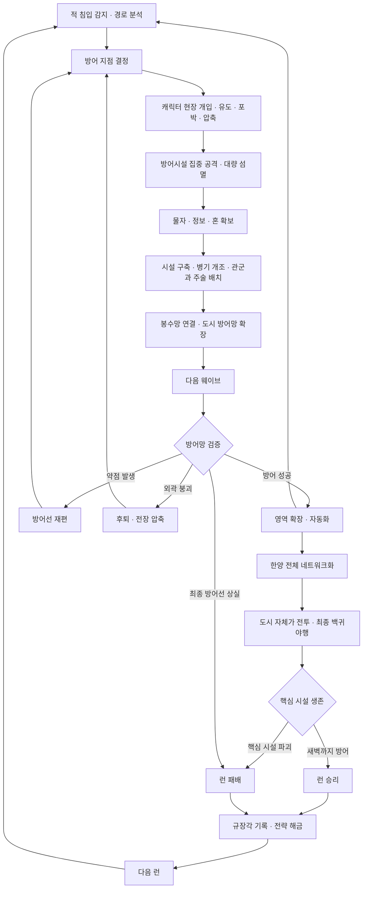

# Core Loop

**전투 → 자원 확보 → 건설 → 연결 → 검증 → 재편 → 전투**

## 시간 규모별 설계 가설

| 규모 | 반복 행동 | 관찰할 피드백 |
|---|---|---|
| 10~30초 | 위험 발견, 흐름 제어, 시설 사격 | 적의 집결과 누수 |
| 1~3분 | 확보, 건설, 개조 | 배치의 효과와 자원 부족 |
| 3~5분 | 연결, 사건 대응, 재편 | 연결망 변화와 약점 |
| 한 런 | 외곽에서 도시 전체로 확장, 필요시 후퇴 | 도시가 싸우는 완성감 |
| 런 사이 | 기록, 선택지 해금 | 다른 방어 전략 |

위 시간은 튜닝 가설이다. 첫 프로토타입은 짧은 고정 시나리오로 검증한다.

## 붕괴의 의미

외곽 시설 일부를 포기하고 남은 방어 수단을 안쪽 병목에 재배치한다. 후퇴 시 적 밀도가 증가하면서 집중 화력의 기회도 생긴다. 최종 핵심 시설이 파괴되면 런을 종료한다.

WP-001은 유도·압축·섬멸, WP-002는 연결에 따른 행동 변화, WP-003은 검증·붕괴·재편을 다룬다. 자원 경제와 장기 성장은 이 세 가설을 확인한 뒤 추가한다.

## 목표 루프 확장 (2026-09-20, D-054)

준비 물자 → 첫 배치 → 성밖 접근 예고 → 성문 공방 → 처치/웨이브 물자 → 추가 건설·연결 → 성문 돌파 → 장승 유도/공성 파괴 → 외곽 붕괴 → 무료 회수·내곽 증설 → 최종 방어.

이는 단계적 구현 목표다. WP-008은 현재 맵에서 준비/건설/물자만, WP-009는 성밖/성문, WP-010은 장승 파괴를 맡는다. 외곽 거점 붕괴와 성문 파괴는 서로 다른 사건이다. [세부 계획](GAMEPLAY_EXPANSION_PLAN.md).

## 확장 단계 (2026-09-23, D-056 / P-021)

위 루프를 콘텐츠 한 개 단위로 나눈 확장 순서와 단계별 테스트 모드(`--stage=N`)는 [CORE_LOOP_STAGES](CORE_LOOP_STAGES.md)에 있다. 분류 순서는 GPT 확인 대기 제안이다.
